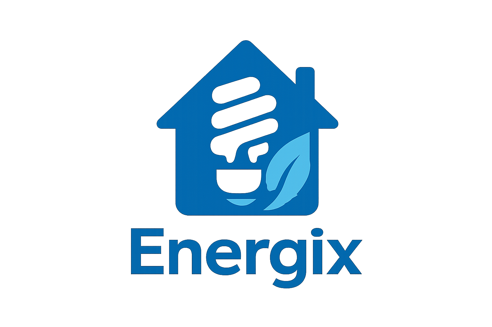

# Capítulo I: Introducción

## 1.1. Startup Profile
### 1.1.1. Descripción de la Startup
Somos Energix, un Startup conformado por estudiantes de la Universidad Peruana de Ciencias Aplicadas (UPC) con el objetivo de crear una plataforma que contribuya a la optimización del consumo energético y que genere un impacto positivo en la economía de hogares que utilizan múltiples artefactos electrónicos.
Nuestra misión es contribuir a la reducción de costos energéticos mediante el uso de Energix Manager. Para lograrlo, ofrecemos una solución integral que proporciona a los usuarios informes semanales detallados sobre el consumo de energía, alertas automatizadas cuando un dispositivo presenta un uso excesivo, y herramientas de monitoreo en tiempo real que les permiten supervisar el comportamiento energético de cada uno de sus electrodomésticos y equipos electrónicos.

- Misión: Nuestra misión es desarrollar una herramienta que ayude a las personas a monitorear, entender y optimizar su consumo energético, promoviendo hábitos responsables que beneficien a su economía.
- Visión: Nuestra visión es ser reconocidos como una plataforma líder en gestión energética para hogares, ofreciendo soluciones inteligentes que permitan a las personas tomar el control de su consumo energético y reducir sus gastos.

- Logo de la Startup:

### 1.1.2. Perfiles de integrantes del equipo

| Nombre | Descripción |
|--------|-------------|
| Yeira Shari | Datos 1     |
| Mateo Ítalo | Datos 2     |
| Iker Gabriel | Datos 3     |
| Alexis | Datos 4     |
| Andrés Rodrigo | Datos 5     |

## 1.2. Solution Profile

### 1.2.1 Antecedentes y problemática
#### En las ultimas décadas, el crecimiento poblacional y el aumento de dispositivos electrónicos en los hogares han generado un incremento significativo en la demanda energética. Según el informe World Energy Outlook 2023 de la Agencia Internacional de Energía (IEA).
#### En Perú, el Ministerio de Energía y Minas indicó en su boletín estadístico 2022 que el consumo residencial alcanzó el 28.6% del total de electricidad nacional, siendo los electrodomésticos, sistemas de iluminación y aparatos conectados permanentemente a la red los principales responsables de dicho gasto, impactando negativamente al medio ambiente y a la economía familiar. 
#### En los hogares, muchas veces no se cuentan con información clara sobre cuánta energía consume cada artefacto, lo que dificulta tomar desiciones para reducir el gasto. A esto se suma la falta de hábitos de consumo eficiente, como el uso de focos LED o la desconexión de equipos en reposo. Además, la mayoría de usuarios solo conoce su consumo mediante el recibo mensual.
#### Frente a esta problemática, surge Energix, una plataforma que brinda a los usuarios informes personalizados, alertas automáticas ante consumos inusuales y monitoreo en tiempo real, permitíendoles gestionar de manera efectiva el usuo energético de cada uno de sus dispositivos.
### 1.2.2 Lean UX Process.

#### 1.2.2.1. Lean UX Problem Statements.

#### 1.2.2.2. Lean UX Assumptions.

#### 1.2.2.3. Lean UX Hypothesis Statements.

#### 1.2.2.4. Lean UX Canvas.

## 1.3. Segmentos objetivos.

### Segmento objetivo #1: 

### Segmento objetivo #2: 
