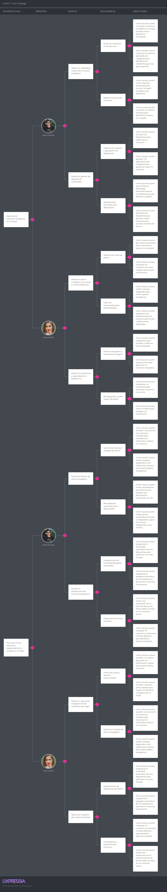

# Capitulo 3: Requirements specification.

## 3.1 User Stories

En el desarrollo de la plataforma Smart Energy Management System (SEMS) se definieron nueve épicas que abarcan todo el recorrido del usuario: desde registrarse y gestionar su cuenta, hasta monitorear dispositivos, recibir alertas, analizar reportes y optimizar su consumo energético.

Estas épicas se diseñaron tomando como base Domain-Driven Design (DDD), lo que permitió dividir el sistema en bounded contexts claros y funcionales. Gracias a esto, cada parte de la plataforma tiene responsabilidades bien definidas y puede crecer de manera independiente y escalable.

Las User Stories fueron redactadas siguiendo principios de User Experience (UX) y apoyadas en una arquitectura REST, lo que asegura que la interacción de los usuarios sea sencilla y fluida, al mismo tiempo que la parte técnica se mantiene ordenada y lista para integrarse con servicios distribuidos.

Cada User Story combina dos perspectivas:

* Una visión funcional, que explica lo que necesita el usuario y el valor que obtiene.

* Una visión técnica, con criterios de aceptación escritos en formato Dado–Cuando–Entonces, lo que facilita probar cada caso de uso y garantizar su cumplimiento.

Con este enfoque, las User Stories cubren áreas clave como la seguridad de cuentas, la conexión de dispositivos IoT, las alertas y notificaciones, los reportes y proyecciones, las herramientas de ahorro, la asesoría al usuario, la gestión avanzada de roles y la experiencia en la página de inicio.

| StoryID | Title                                              | Description                                                                                                                           | Acceptance Criteria                                                                                                                                                                                                                                                                                                                                                                                                                                                                                                                                                                                                               | Epic |
|---------|----------------------------------------------------|---------------------------------------------------------------------------------------------------------------------------------------|-----------------------------------------------------------------------------------------------------------------------------------------------------------------------------------------------------------------------------------------------------------------------------------------------------------------------------------------------------------------------------------------------------------------------------------------------------------------------------------------------------------------------------------------------------------------------------------------------------------------------------------|------|
| US01    | Registro de cuenta                                 | Como usuario, quiero registrarme en la plataforma para acceder a todas las funcionalidades.                                           | Escenario 1: Registro válido  Dado que no dispongo de una cuenta Cuando confirmo mi registro con datos completos y válidos Entonces el sistema crea mi cuenta y la habilita    Escenario 2: Datos inválidos  Dado que ingreso datos incompletos o incorrectos Cuando intento registrarme Entonces el sistema rechaza el registro e informa los errores    Escenario 3: Correo duplicado  Dado que un correo ya está registrado Cuando intento usarlo para crear otra cuenta Entonces el sistema rechaza el proceso                                                    | EP01 |
| US02    | Inicio de sesión                                   | Como usuario, quiero autenticarme en la plataforma para gestionar mi consumo energético.                                              | Escenario 1: Credenciales válidas  Dado que dispongo de una cuenta registrada Cuando ingreso credenciales correctas Entonces el sistema me concede acceso    Escenario 2: Contraseña incorrecta  Dado que la contraseña ingresada no es correcta Cuando intento iniciar sesión Entonces el sistema rechaza el acceso y muestra el error    Escenario 3: Cuenta inexistente  Dado que el correo ingresado no está registrado Cuando intento iniciar sesión Entonces el sistema rechaza el acceso y muestra el error                                                    | EP01 |
| US03    | Configuración de perfil inicial                    | Como usuario, quiero registrar el tipo de vivienda y dispositivos básicos para personalizar mi experiencia.                           | Escenario 1: Configuración completa  Dado que dispongo de una cuenta registrada Cuando configuro los datos iniciales de mi perfil Entonces el sistema guarda la información correctamente    Escenario 2: Datos incompletos  Dado que ingreso información incompleta en la configuración Cuando intento guardar los cambios Entonces el sistema rechaza la configuración y muestra el error                                                                                                                                                                                                   | EP01 |
| US04    | Recuperar contraseña                               | Como usuario, quiero restablecer mi contraseña en caso de olvido para recuperar el acceso a mi cuenta.                                | Escenario 1: Solicitud de restablecimiento  Dado que el usuario no recuerda su contraseña Cuando solicita el restablecimiento con un correo válido Entonces el sistema envía un enlace de recuperación Y muestra el mensaje: "Hemos enviado un enlace de recuperación a tu correo."    Escenario 2: Cambio exitoso de contraseña  Dado que el usuario accede al enlace de recuperación Cuando establece una nueva contraseña válida Entonces el sistema actualiza la credencial Y muestra el mensaje: "Tu contraseña ha sido actualizada"                                               | EP01 |
| US05    | Cerrar sesión de manera segura                     | Como usuario, quiero cerrar mi sesión de forma segura para proteger mi información.                                                   | Escenario 1: Cierre de sesión manual  Dado que el usuario tiene una sesión activa Cuando solicita cerrar sesión Entonces el sistema finaliza la sesión actual Y muestra el mensaje: "Has cerrado sesión correctamente."    Escenario 2: Cierre de sesión automático por inactividad  Dado que el usuario permanece inactivo por un periodo prolongado Cuando se supera el tiempo límite definido Entonces el sistema cierra la sesión automáticamente                                                                                                                                      | EP01 |
| US06    | Conectar dispositivos                              | Como usuario, quiero vincular mis dispositivos eléctricos al sistema para supervisar su consumo.                                      | Escenario 1: Dispositivo detectado  Dado que dispongo de un dispositivo compatible Cuando solicito conectarlo Entonces el sistema lo vincula exitosamente    Escenario 2: Dispositivo no compatible  Dado que el dispositivo no es compatible Cuando intento conectarlo Entonces el sistema rechaza la conexión y muestra el error                                                                                                                                                                                                                                                            | EP02 |
| US07    | Identificación automática de dispositivos          | Como usuario, quiero que el sistema identifique automáticamente los dispositivos conectados para facilitar su gestión.                | Escenario 1: Identificación exitosa  Dado que el dispositivo está conectado Cuando el sistema lo reconoce Entonces asigna automáticamente su categoría    Escenario 2: Identificación fallida  Dado que el dispositivo no puede identificarse Cuando se intenta clasificar Entonces el sistema solicita al usuario definirlo                                                                                                                                                                                                                                                                  | EP02 |
| US08    | Monitorear consumo en tiempo real                  | Como usuario, quiero consultar el consumo energético en tiempo real para tomar decisiones inmediatas.                                 | Escenario 1: Consumo actualizado  Dado que el usuario tiene dispositivos conectados Cuando consulta el panel de consumo Entonces el sistema muestra la información actualizada en tiempo real Y presenta el mensaje: "Consumo actualizado correctamente"    Escenario 2: Dispositivo desconectado  Dado que un dispositivo pierde la conexión Cuando el usuario revisa el panel Entonces el sistema indica que el dispositivo está sin datos en tiempo real Y muestra el mensaje: "Dispositivo desconectado"                                                                            | EP02 |
| US09    | Generar alertas de consumo elevado                 | Como usuario, quiero recibir alertas automáticas cuando un dispositivo supere el consumo establecido como normal.                     | Escenario 1: Envío de alerta por exceso de consumo  Dado que un dispositivo supera un umbral definido Cuando ocurre este exceso de consumo Entonces el sistema envía una alerta inmediata al usuario Y muestra el mensaje: "Alerta: consumo elevado detectado"    Escenario 2: Registro de alerta en historial  Dado que se genera una alerta por exceso de consumo Cuando el usuario consulta el historial de notificaciones Entonces el sistema muestra la alerta registrada con fecha y hora Y acompaña la entrada con el texto: "Historial de alertas actualizado"                  | EP03 |
| US10    | Recordatorios de desconexión de equipos en reposo  | Como usuario, quiero recibir recordatorios para desconectar equipos que permanecen conectados sin uso.                                | Escenario 1: Recordatorio por inactividad  Dado que un equipo permanece enchufado sin actividad Cuando se detecta inactividad prolongada Entonces el sistema envía un recordatorio de desconexión al usuario Y muestra el mensaje: "Recuerda desconectar tus equipos inactivos"    Escenario 2: Configuración de recordatorios  Dado que el usuario define la frecuencia de recordatorios Cuando un equipo permanece inactivo Entonces el sistema respeta la configuración establecida para enviar avisos                                                                                  | EP03 |
| US11    | Configurar umbrales de alerta personalizados       | Como usuario, quiero establecer mis propios límites de consumo para recibir notificaciones adaptadas a mis necesidades                | Escenario 1: Generación de alerta personalizada  Dado que el usuario define un límite de consumo Cuando un dispositivo lo supera Entonces el sistema genera la alerta según la configuración establecida Y muestra el mensaje: "Tu dispositivo ha superado el límite configurado"    Escenario 2: Restablecimiento de valores por defecto  Dado que el usuario modifica los umbrales de consumo Cuando solicita restablecer la configuración Entonces el sistema aplica nuevamente los valores predeterminados Y confirma con el mensaje: "Se han restablecido los valores por defecto" | EP03 |
| US12    | Consultar reporte semanal de consumo               | Como usuario, quiero revisar reportes semanales para conocer mi gasto energético desglosado por dispositivo.                          | Escenario 1: Generación automática del reporte  Dado que finalizó una semana de uso Cuando el usuario consulta su informe Entonces el sistema presenta el consumo total y el detalle por dispositivo    Escenario 2: Descarga del reporte en PDF  Dado que el usuario consulta su informe semanal Cuando solicita la descarga Entonces el sistema genera el reporte en formato PDF Y confirma con el mensaje: "Tu reporte se ha descargado correctamente"                                                                                                                                  | EP04 |
| US13    | Comparar consumo entre periodos                    | Como usuario, quiero comparar mi consumo en semanas o meses distintos para identificar patrones de gasto.                             | Escenario 1: Comparación entre semanas  Dado que el usuario selecciona dos periodos de tiempo Cuando solicita la comparación Entonces el sistema muestra las diferencias en porcentajes y gráficos    Escenario 2: Comparación entre meses  Dado que el usuario selecciona dos meses específicos Cuando genera la comparación Entonces el sistema presenta los resultados en formato visual                                                                                                                                                                                                   | EP04 |
| US14    | Proyección de factura mensual                      | Como usuario, quiero recibir una estimación de mi próxima factura de electricidad con base en mi consumo actual.                      | Escenario 1: Proyección de factura activa  Dado que el sistema tiene acumulado el consumo actual Cuando el usuario solicita la proyección Entonces el sistema muestra el monto estimado de la próxima factura Y presenta el mensaje: "Este es el monto estimado de tu próxima factura"    Escenario 2: Consumo insuficiente para proyección  Dado que el usuario recién comenzó a registrar su consumo Cuando solicita una proyección Entonces el sistema indica que no hay datos suficientes Y muestra el mensaje: "No es posible calcular la proyección con los datos actuales"       | EP04 |
| US15    | Consultar historial de consumo mensual             | Como usuario, quiero consultar un historial de mi consumo mensual para identificar cambios en mi gasto energético.                    | Escenario 1: Visualización de historial  Dado que el usuario tiene consumos registrados en meses anteriores Cuando accede a la sección de historial Entonces el sistema muestra el consumo por cada mes    Escenario 2: Descarga de historial  Dado que el usuario consulta el historial mensual Cuando solicita la descarga Entonces el sistema genera un archivo en formato PDF                                                                                                                                                                                                             | EP04 |
| US16    | Recomendaciones personalizadas de ahorro           | Como usuario, quiero recibir consejos adaptados a mis hábitos de consumo para reducir gastos energéticos.                             | Escenario 1: Generación de recomendaciones  Dado que el sistema analiza los patrones de uso del usuario Cuando detecta oportunidades de mejora Entonces entrega sugerencias prácticas en el panel de recomendaciones    Escenario 2: Actualización de recomendaciones  Dado que el usuario modifica sus hábitos de consumo Cuando se actualizan los registros Entonces el sistema genera nuevas recomendaciones adaptadas                                                                                                                                                                     | EP05 |
| US17    | Establecer metas de ahorro energético              | Como usuario, quiero fijar metas mensuales de ahorro para motivarme a reducir mi consumo.                                             | Escenario 1: Definición de meta mensual  Dado que el usuario establece un porcentaje de reducción de consumo Cuando confirma su objetivo Entonces el sistema registra la meta de ahorro Y muestra el mensaje: "Meta de ahorro registrada correctamente"    Escenario 2: Seguimiento de progreso  Dado que el usuario tiene una meta activa Cuando consulta el avance Entonces el sistema indica el porcentaje logrado hasta la fecha                                                                                                                                                       | EP05 |
| US18    | Comparar consumo con otros usuarios                | Como usuario, quiero comparar mi consumo con el de hogares similares para evaluar mi eficiencia energética.                           | Escenario 1: Comparación con hogares del mismo tipo  Dado que el usuario tiene un perfil de vivienda registrado Cuando solicita la comparación Entonces el sistema presenta métricas frente a usuarios semejantes    Escenario 2: Ranking de eficiencia  Dado que existen múltiples usuarios en la plataforma Cuando se genera un ranking comparativo Entonces el sistema muestra la posición del usuario en relación con los demás                                                                                                                                                           | EP05 |
| US19    | Programar encendido automático de dispositivos     | Como usuario, quiero programar el encendido automático de mis dispositivos para optimizar el uso de energía.                          | Escenario 1: Programación exitosa de encendido  Dado que el usuario establece un horario de encendido Cuando confirma la programación Entonces el sistema activa el dispositivo en la hora definida Y muestra el mensaje: "Encendido programado correctamente"    Escenario 2: Intento de programación inválida  Dado que el usuario define un horario en conflicto con otro ya registrado Cuando intenta guardar la programación Entonces el sistema rechaza el registro Y presenta el mensaje: "El horario seleccionado entra en conflicto con una programación existente"            | EP05 |
| US20    | Programar apagado automático de dispositivos       | Como usuario, quiero programar el apagado automático de mis dispositivos para evitar consumos innecesarios.                           | Escenario 1: Programación de apagado válida  Dado que el usuario establece un horario de apagado Cuando confirma la programación Entonces el sistema desactiva el dispositivo en la hora definida    Escenario 2: Confirmación de programación  Dado que el usuario ha guardado una programación válida Cuando revisa la configuración Entonces el sistema muestra el mensaje: "Apagado programado correctamente"                                                                                                                                                                             | EP05 |
| US21    | Acceder a asesoría personalizada en eficiencia energética | Como usuario, quiero acceder a asesoría personalizada para mejorar la eficiencia energética de mi hogar.                              | Escenario 1: Solicitud de asesoría  Dado que el usuario solicita asesoría personalizada Cuando la plataforma recibe la solicitud Entonces el sistema agenda una sesión con un especialista Y confirma con el mensaje: "Tu solicitud de asesoría ha sido registrada"    Escenario 2: Revisión de historial de asesorías  Dado que el usuario ha recibido asesorías previas Cuando accede a su historial Entonces el sistema muestra la información de asesorías anteriores                                                                                                                  | EP06 |
| US22    | Consultar centro de ayuda                          | Como usuario, quiero acceder a un centro de ayuda con información y guías para resolver dudas comunes.                                | Escenario 1: Acceso al centro de ayuda  Dado que el usuario selecciona la opción de ayuda Cuando entra al apartado Entonces el sistema muestra artículos y guías disponibles    Escenario 2: Búsqueda dentro del centro de ayuda  Dado que el usuario necesita resolver una duda específica Cuando introduce una palabra clave en la búsqueda Entonces el sistema lista los artículos relacionados                                                                                                                                                                                            | EP06 |
| US23    | Contactar soporte técnico                          | Como usuario, quiero contactar al soporte técnico para resolver problemas con la plataforma.                                          | Escenario 1: Envío de consulta a soporte  Dado que el usuario redacta una solicitud de soporte Cuando la envía al sistema Entonces el sistema confirma la recepción Y muestra el mensaje: "Tu solicitud de soporte ha sido enviada"    Escenario 2: Recepción de respuesta de soporte  Dado que el usuario tiene una consulta registrada Cuando el equipo de soporte responde Entonces el sistema notifica al usuario con el mensaje: "Has recibido una respuesta de soporte"                                                                                                              | EP06 |
| US24    | Agrupar dispositivos por categorías                | Como usuario, quiero agrupar mis dispositivos por categorías (ejemplo: cocina, sala, dormitorio) para gestionar mejor mi consumo.     | Escenario 1: Creación de una categoría  Dado que el usuario define una nueva categoría de dispositivos Cuando guarda la configuración Entonces el sistema registra la categoría Y confirma con el mensaje: "Categoría creada exitosamente"    Escenario 2: Asignación de dispositivos a categoría  Dado que el usuario tiene dispositivos registrados Cuando los asigna a una categoría Entonces el sistema organiza el consumo según la clasificación definida                                                                                                                            | EP07 |
| US25    | Consultar consumo por categoría de dispositivos    | Como usuario, quiero consultar el consumo energético agrupado por categorías para identificar los ambientes que más gasto generan.    | Escenario 1: Visualización de consumo por categoría  Dado que el usuario tiene dispositivos asignados a categorías Cuando solicita un reporte por categoría Entonces el sistema muestra el consumo total agrupado    Escenario 2: Comparación entre categorías  Dado que el usuario tiene varias categorías registradas Cuando selecciona dos o más categorías Entonces el sistema presenta un gráfico comparativo                                                                                                                                                                            | EP07 |
| US26    | Identificar dispositivos de alto consumo           | Como usuario, quiero identificar los dispositivos que generan mayor consumo energético para priorizar acciones de ahorro.             | Escenario 1: Listado de dispositivos más consumidores  Dado que el sistema registra el consumo de cada dispositivo Cuando el usuario consulta el ranking Entonces el sistema presenta los dispositivos ordenados por mayor gasto    Escenario 2: Alerta por dispositivo crítico  Dado que un dispositivo supera ampliamente el consumo promedio Cuando el sistema lo identifica Entonces muestra el mensaje: "Este dispositivo registra un consumo inusualmente alto"                                                                                                                         | EP07 |
| US27    | Administrar múltiples cuentas en un mismo hogar    | Como usuario, quiero permitir que varios miembros de mi hogar gestionen dispositivos desde sus propias cuentas.                       | Escenario 1: Invitación a un nuevo miembro  Dado que el usuario principal autoriza otra cuenta Cuando se envía la invitación Entonces el sistema registra al nuevo miembro Y confirma con el mensaje: "Invitación enviada correctamente"    Escenario 2: Gestión compartida de dispositivos  Dado que existen múltiples cuentas en un hogar Cuando un miembro gestiona un dispositivo Entonces los cambios se reflejan en todas las cuentas vinculadas                                                                                                                                     | EP08 |
| US28    | Definir roles de acceso en el hogar                | Como usuario, quiero asignar diferentes niveles de acceso (administrador o invitado) para controlar permisos dentro de la plataforma. | Escenario 1: Asignación de rol de administrador  Dado que el usuario principal define a otro miembro como administrador Cuando guarda los cambios Entonces el sistema otorga permisos de gestión completa    Escenario 2: Asignación de rol de invitado  Dado que el usuario principal define a un miembro como invitado Cuando guarda los cambios Entonces el sistema restringe las acciones a solo visualización                                                                                                                                                                            | EP08 |
| US29    | Cambiar idioma de la plataforma                    | Como usuario, quiero cambiar el idioma de la plataforma para comprender mejor la información según mi preferencia.                    | Escenario 1: Selección de idioma  Dado que el usuario se encuentra en la plataforma Cuando selecciona un idioma disponible Entonces el sistema actualiza el contenido a ese idioma Y muestra el mensaje: "Idioma cambiado correctamente"    Escenario 2: Persistencia de idioma  Dado que el usuario seleccionó un idioma previamente Cuando vuelve a iniciar sesión Entonces el sistema mantiene la configuración del idioma elegido                                                                                                                                                      | EP09 |
| US30    | Consultar noticias y consejos de ahorro energético | Como usuario, quiero acceder a una sección con noticias y consejos para mantenerme informado y reducir mi consumo.                    | Escenario 1: Visualizar sección de noticias  Dado que el usuario accede a la plataforma Cuando entra en la sección de noticias Entonces el sistema muestra artículos informativos y consejos de ahorro    Escenario 2: Acceder a detalle de noticia  Dado que el usuario selecciona un artículo específico Cuando abre la publicación Entonces el sistema presenta el contenido completo                                                                                                                                                                                                      | EP09 |
| US31    | Consultar la propuesta de valor                    | Como visitante, quiero visualizar claramente la propuesta de valor de la plataforma para entender sus beneficios.                     | Escenario 1: Acceso a la propuesta de valor  Dado que el visitante accede a la landing page Cuando visualiza la sección principal Entonces el sistema muestra un encabezado con un mensaje sobre gestión inteligente de energía    Escenario 2: Revisión de beneficios  Dado que el visitante se encuentra en la propuesta de valor Cuando revisa el contenido Entonces el sistema presenta un conjunto de beneficios que incluyen ahorro, monitoreo, sostenibilidad, soporte y alertas                                    | EP10 |
| US32    | Acceder a preguntas frecuentes (FAQ)               | Como visitante, quiero acceder a una sección de preguntas frecuentes para resolver mis dudas sin necesidad de reporte.                | Escenario 1: Visualización de FAQ  Dado que el visitante accede a la sección de preguntas frecuentes Cuando carga la página Entonces el sistema muestra una lista con las dudas más comunes de los usuarios    Escenario 2: Acceso a respuestas  Dado que el visitante selecciona una pregunta Cuando consulta la información Entonces el sistema despliega una respuesta breve que explica la funcionalidad o el servicio asociado                                                                                                                                                                                                                                                                                                                                                                                                                                                                             | EP10 |
| US33    | Revisar planes de suscripción                      | Como visitante, quiero revisar los planes de suscripción para comparar precios y beneficios antes de decidir.                         | Escenario 1: Acceso a planes de suscripción  Dado que el visitante accede a la sección de suscripciones Cuando revisa el contenido Entonces el sistema muestra diferentes planes con precios y beneficios    Escenario 2: Comparación de planes  Dado que el visitante analiza las opciones Cuando compara los planes Entonces el sistema destaca las diferencias principales entre los niveles básico, intermedio y avanzado                                                                                                                                                                                                                                                                                                                                                                                                                                                                             | EP10 |
| US34    | Consultar información del equipo                   | Como visitante, quiero conocer al equipo de desarrollo para sentir confianza en el servicio que brinda la plataforma.                 | Escenario 1: Visualización de misión, visión y valores  Dado que el visitante accede a la sección del equipo Cuando consulta la información Entonces el sistema muestra la misión, visión y valores de la plataforma    Escenario 2: Información de integrantes  Dado que el visitante explora la sección del equipo Cuando revisa el contenido Entonces el sistema presenta un listado con los miembros principales y sus roles generales en el proyecto                                                                                                                                                                                                                                                                                                                                                                                                                                                                             | EP10 |
| US35    | Cambiar idioma                                     | Como visitante, quiero cambiar el idioma de la landing page entre español e inglés para entender mejor la información                 | Escenario 1: Traducción completa a inglés  Dado que el visitante accede a la Landing Page Cuando selecciona el idioma inglés Entonces el sistema presenta todos los textos de la página en inglés    Escenario 2: Traducción completa a español  Dado que el visitante accede a la Landing Page Cuando selecciona el idioma español Entonces el sistema muestra de forma consistente todo el contenido en español                                                                                                                                                                                                                                                                                                                                                                                                                                                                                         | EP10 |

## 3.2 Impact Mapping.

## 3.3 Product Backlog.

| # Orden | User Story Id | Título                                              | Descripción                                                                 | Story Points (1 / 2 / 3 / 5 / 8) |
|---------|---------------|-----------------------------------------------------|-----------------------------------------------------------------------------|-----------------------------------|
| 1       | US01          | Registro de cuenta                                  | Como usuario, quiero registrarme en la plataforma para acceder a todas las funcionalidades. | 3                                 |
| 2       | US02          | Inicio de sesión                                    | Como usuario, quiero autenticarme en la plataforma para gestionar mi consumo energético. | 2                                 |
| 3       | US03          | Configuración de perfil inicial                     | Como usuario, quiero registrar el tipo de vivienda y dispositivos básicos para personalizar mi experiencia. | 3                                 |
| 4       | US04          | Recuperar contraseña                                | Como usuario, quiero restablecer mi contraseña en caso de olvido para recuperar el acceso a mi cuenta. | 2                                 |
| 5       | US05          | Cerrar sesión de manera segura                      | Como usuario, quiero cerrar mi sesión de forma segura para proteger mi información. | 1                                 |
| 6       | US06          | Conectar dispositivos                               | Como usuario, quiero vincular mis dispositivos eléctricos al sistema para supervisar su consumo. | 5                                 |
| 7       | US07          | Identificación automática de dispositivos           | Como usuario, quiero que el sistema identifique automáticamente los dispositivos conectados para facilitar su gestión. | 5                                 |
| 8       | US08          | Monitorear consumo en tiempo real                   | Como usuario, quiero consultar el consumo energético en tiempo real para tomar decisiones inmediatas. | 5                                 |
| 9       | US09          | Generar alertas de consumo elevado                  | Como usuario, quiero recibir alertas automáticas cuando un dispositivo supere el consumo establecido como normal. | 3                                 |
| 10      | US10          | Recordatorios de desconexión de equipos en reposo   | Como usuario, quiero recibir recordatorios para desconectar equipos que permanecen conectados sin uso. | 2                                 |
| 11      | US11          | Configurar umbrales de alerta personalizados        | Como usuario, quiero establecer mis propios límites de consumo para recibir notificaciones adaptadas a mis necesidades. | 3                                 |
| 12      | US12          | Consultar reporte semanal de consumo                | Como usuario, quiero revisar reportes semanales para conocer mi gasto energético desglosado por dispositivo. | 2                                 |
| 13      | US13          | Comparar consumo entre periodos                     | Como usuario, quiero comparar mi consumo en semanas o meses distintos para identificar patrones de gasto. | 3                                 |
| 14      | US14          | Proyección de factura mensual                       | Como usuario, quiero recibir una estimación de mi próxima factura de electricidad con base en mi consumo actual. | 2                                 |
| 15      | US15          | Consultar historial de consumo mensual              | Como usuario, quiero consultar un historial de mi consumo mensual para identificar cambios en mi gasto energético. | 2                                 |
| 16      | US16          | Recomendaciones personalizadas de ahorro            | Como usuario, quiero recibir consejos adaptados a mis hábitos de consumo para reducir gastos energéticos. | 3                                 |
| 17      | US17          | Establecer metas de ahorro energético               | Como usuario, quiero fijar metas mensuales de ahorro para motivarme a reducir mi consumo. | 2                                 |
| 18      | US18          | Comparar consumo con otros usuarios                 | Como usuario, quiero comparar mi consumo con el de hogares similares para evaluar mi eficiencia energética. | 3                                 |
| 19      | US19          | Programar encendido automático de dispositivos      | Como usuario, quiero programar el encendido automático de mis dispositivos para optimizar el uso de energía. | 5                                 |
| 20      | US20          | Programar apagado automático de dispositivos        | Como usuario, quiero programar el apagado automático de mis dispositivos para evitar consumos innecesarios. | 3                                 |
| 21      | US21          | Acceder a asesoría personalizada en eficiencia energética | Como usuario, quiero acceder a asesoría personalizada para mejorar la eficiencia energética de mi hogar. | 2                                 |
| 22      | US22          | Consultar centro de ayuda                           | Como usuario, quiero acceder a un centro de ayuda con información y guías para resolver dudas comunes. | 1                                 |
| 23      | US23          | Contactar soporte técnico                           | Como usuario, quiero contactar al soporte técnico para resolver problemas con la plataforma. | 2                                 |
| 24      | US24          | Agrupar dispositivos por categorías                 | Como usuario, quiero agrupar mis dispositivos por categorías (ejemplo: cocina, sala, dormitorio) para gestionar mejor mi consumo. | 3                                 |
| 25      | US25          | Consultar consumo por categoría de dispositivos     | Como usuario, quiero consultar el consumo energético agrupado por categorías para identificar los ambientes que más gasto generan. | 3                                 |
| 26      | US26          | Identificar dispositivos de alto consumo            | Como usuario, quiero identificar los dispositivos que generan mayor consumo energético para priorizar acciones de ahorro. | 2                                 |
| 27      | US27          | Administrar múltiples cuentas en un mismo hogar     | Como usuario, quiero permitir que varios miembros de mi hogar gestionen dispositivos desde sus propias cuentas. | 5                                 |
| 28      | US28          | Definir roles de acceso en el hogar                 | Como usuario, quiero asignar diferentes niveles de acceso (administrador o invitado) para controlar permisos dentro de la plataforma. | 3                                 |
| 29      | US29          | Cambiar idioma de la plataforma                     | Como usuario, quiero cambiar el idioma de la plataforma para comprender mejor la información según mi preferencia. | 2                                 |
| 30      | US30          | Consultar noticias y consejos de ahorro energético  | Como usuario, quiero acceder a una sección con noticias y consejos para mantenerme informado y reducir mi consumo. | 1                                 |