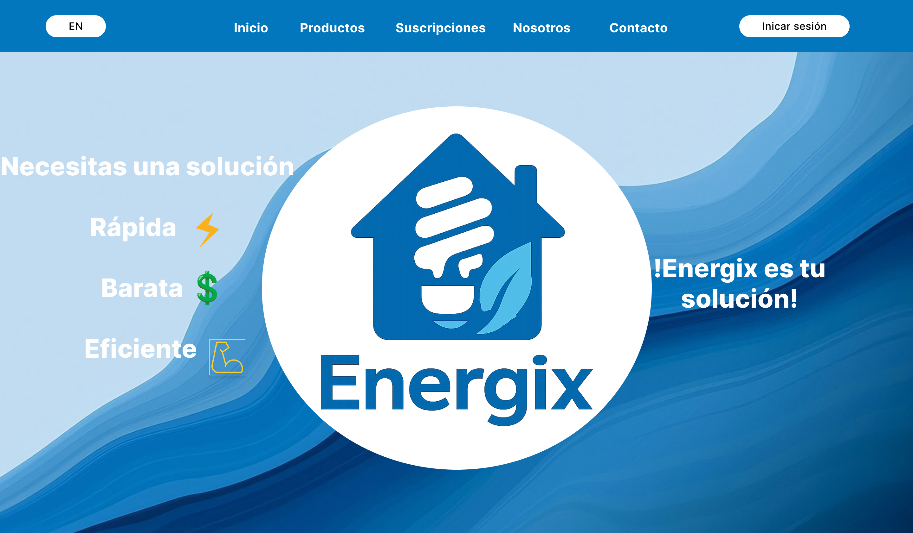
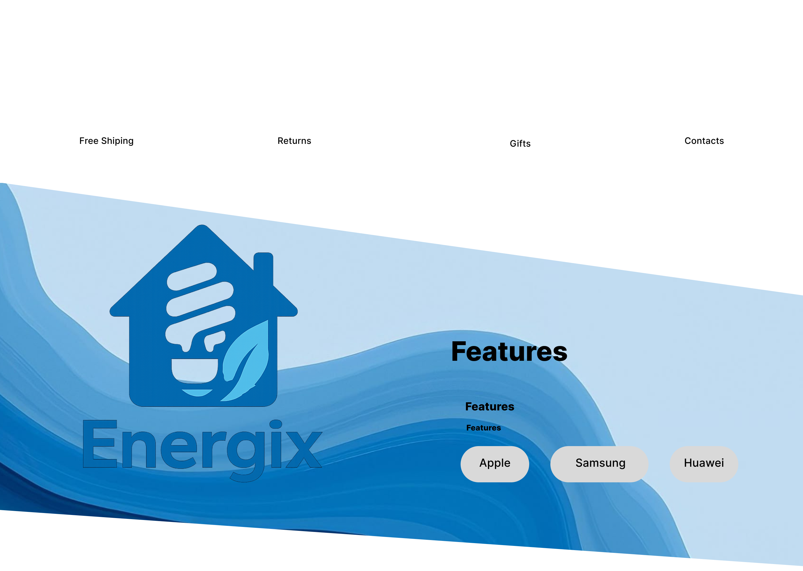
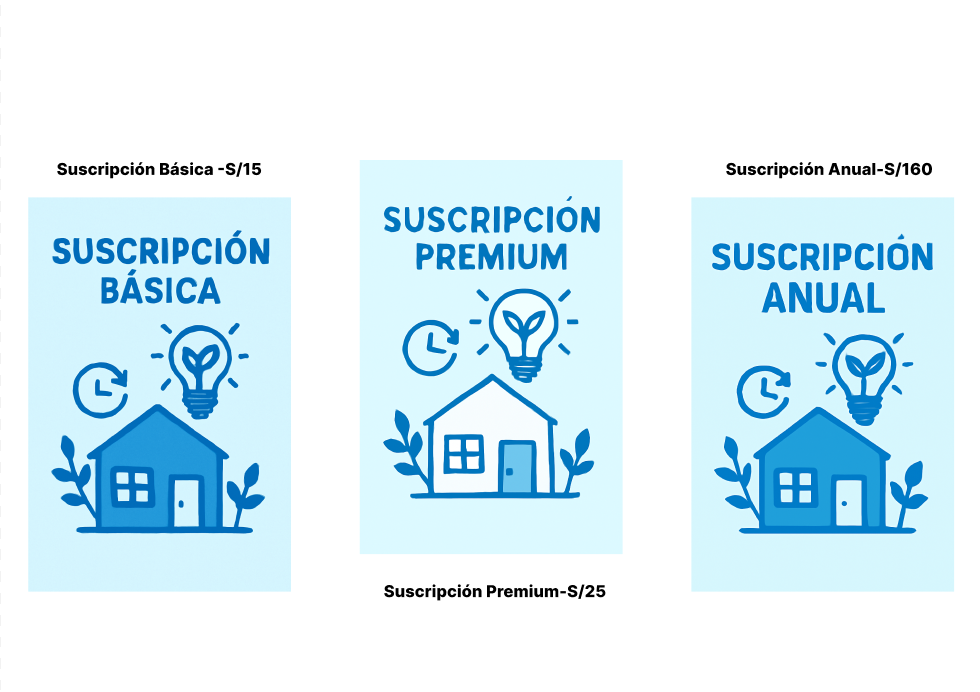
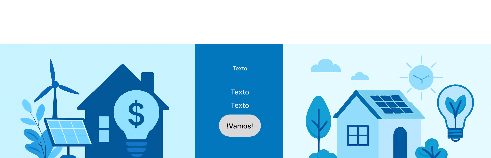
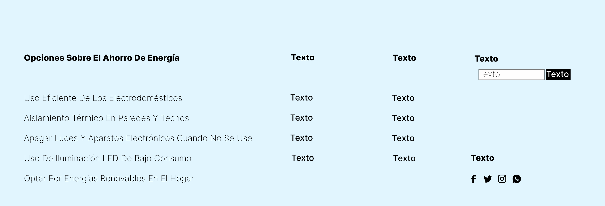
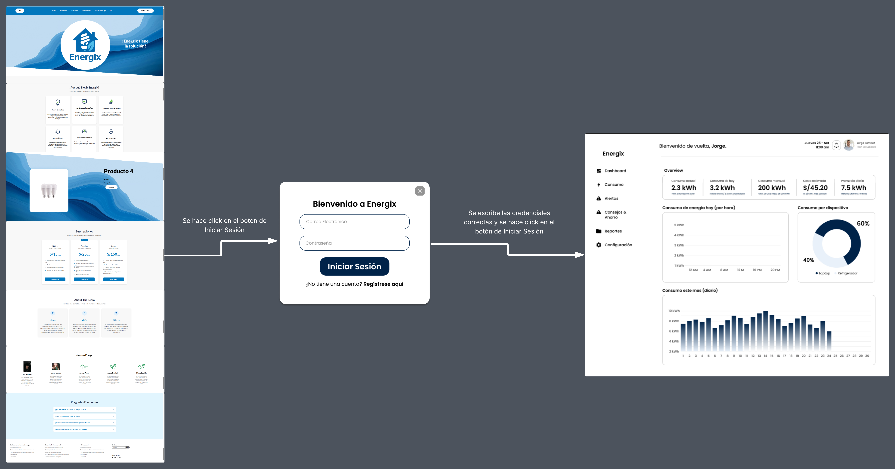
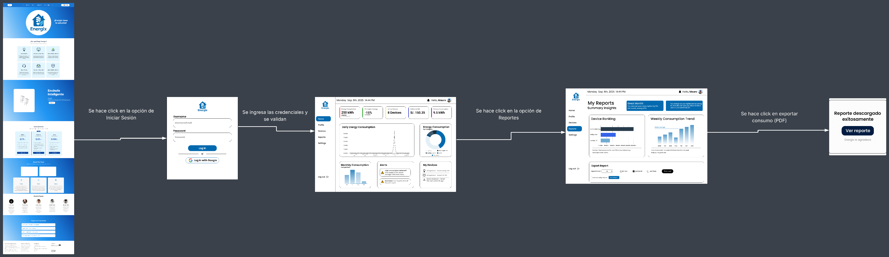
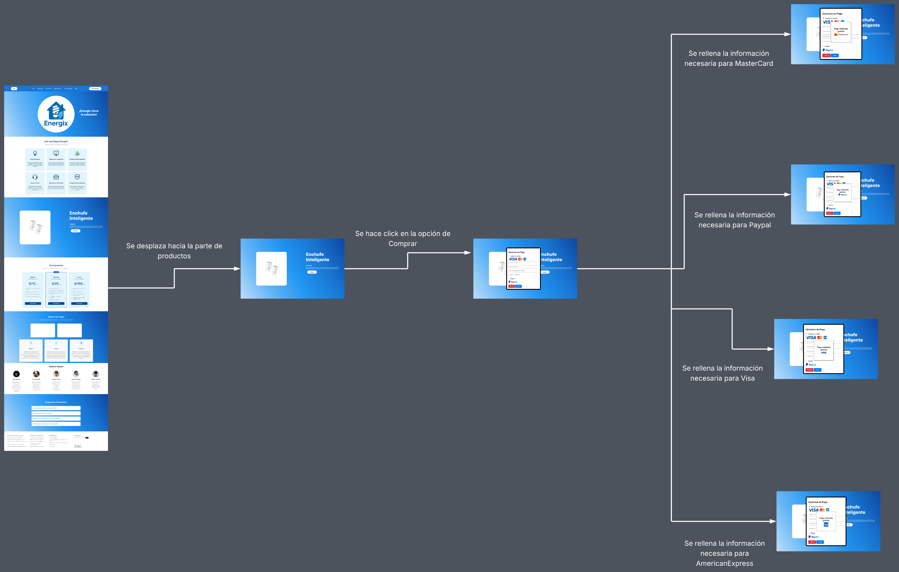
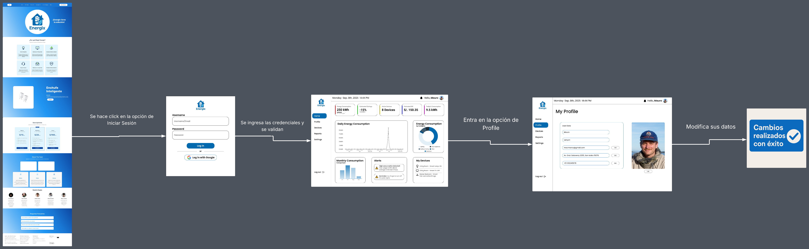

# Capítulo IV: Product Design

## 4.1. Style Guidelines
### 4.1.1. General Style Guidelines
- En esta sección se detallarán las desiciones fundamentales y las referencias visuales utilizadas para definir aspectos principales del proyecto como los siguiente: Branding, tipografía, colores, spacing y tonos de comunicación.
- - Branding
- - - El nombre completo de nuestro servicio es "Smart Energix Manager".
- - - Para el dominio web y la aplicación, así como para ser más memorables se utilizará el nombre corto "Energix".
- - - El logo representa de forma directa y moderna la combinación de un hogar familiar de color azul con la silueta de un foco ahorrador junto a una hoja, superpuesto en el centro del marcador. Esta combinación visual comunica de manera clara la idea de optimizar el consumo energético en los hogares y reducir el impacto ambiental.    

- - Tipografía
- - - La tipografía principal seleccionada es Lato. Esta fuente fue elegida por su clásiscas proporciones, sobretodo en las mayúsculas dando así harmonía y elegancia a las oraciones motrando contemporaneidad sin ser abrumador.
- - - Tamaños:
- - - - Móvil: Títulos 50px, cuerpo y sibtítulos 20px.
- - - - Web: Títulos 50px, cuerpo y subtítulos 50px.
- - Colores 
- - - Utilizaremos la siguiente paleta de colores:
  
- - - - Este azul moderno, representa confianza y presición para la navegación, Se usará en la parte del encabezado guiando al usuario de forma clara. Evocando la fiabilidad de las herrameintas establecidad.  #0277BD 
- - - - Este tono de azul más claro, llamado "Alice Blue", representa frecusra y tranquilidad. Se usará en la parte inferior de la página web, dandole una la sensación al usuario de paz y pureza. #E1F5FE
- - - - Este gris cálido simple simboliza el punto neutro e imparcial representando comodidad y claridad. Se usará tanto en los botones de acción como en los subtítulos del pié de página. #808080
- - - - Este blanco básico representa la simpliciad e igualdad. Se utilizará en el fondo principal de la página web. #FFFFFF 
- - - - Este negro original manifiesta elegancia a la vez que autorizad y sobresalta entre los demás. Será utilizado en los títulos de la parte de suscripciones y de la app móvil. #000000
- - Spacing
- - - El espacio en el diseño de Energix se enfocará en proporcionar una experiencia visual clara y accesible para el usuario, reflejando así los principios de claridad y orden. Del mismo modo se utilizrán márgenes amplios para resaltar elementos claves, como botones, imágenes y títulos, permitiendo una navegación fluida y amigable.
- - - Los títulos y subtítulos contarán con un espaciado vertical generoso, haciendo fácil la lectura y la jerarquización de la información. Los botones e íconos tendrán márgenes precisos para asegurar la consistencia.
- - Tonos de comunicación 
- - - El tono de comunicación de Energix será amigable, cercano y orientado al usuario. Buscamos establecer una genuina conexión, utilizando un lenguaje claro y conciso, utilizando un lenaguaje claro y accesible, evitando así técnicismos innecesarios. Nuestra comunicación será positiva y alentadora, enfocándose en resaltar los beneficios que ofrecemos. Por último se priorizará la empatía y la comprensión de las necesidades del Usuario, ofreciendo ayuda y soporte de manera oportuna y efectiva. Queremos que el usuario se sienta valorado y escuchado en cada interacción
### 4.1.2. Web Style Guidelines

## 4.2. Information Architecture
### 4.2.1. Organization Systems
### 4.2.2. Labeling Systems
### 4.2.3. SEO Tags and Meta Tags
- Los SEO Tag y Meta Tags ayudarán a que la página estática y la aplicación web sea posible de analizar fácilmente y se pueda gestionar de manera eficiente y optima.


- **Título** El título de nuestra Staruo se definirá de la siguiente manera:
- ```html 
  <title>ENERGIX</title>

- **Descripción** Las descripciones de nuestra Starup se definirá de la siguiente manera:
- ```html 
  <meta name="description" content="Energix es una aplicación que ayudará a los usuarios a poder optimizar sus consumos de energía"/>

- **Keywords**: Algunas Keywords como "viewport" se definirá de la siguiente manera:
- ```html 
  <meta name="viewport" content="width=device-width, initial-scale=1.0">

-**Author**: Nuestra marca será registrada en nuestra página de la siguiente manera:
- ```html 
  <meta name="copiright" content="© 2024 ENERGIX. Todos los derechos reservados"/>
### 4.2.4. Searching Systems
### 4.2.5. Navigation Systems

## 4.3. Landing Page UI Design
### 4.3.1. Landing Page Wireframe
### 4.3.2. Landing Page Mock-up
- 
- 
- 
- 
- 
## 4.4. Web Applications UX/UI Design
### 4.4.1. Web Applications Wireframes
### 4.4.2. Web Applications Wireflow Diagrams
### 4.4.2. Web Applications Mock-ups
### 4.4.3. Web Applications User Flow Diagrams
- User goal 1: Iniciar sesión para poder obversar el dashboard informativo
  
- User goal 2: Entrar al dashboard informativo para luego entrar en la opción de Reportes y descargar mi reporte generado a lo largo del mes
  
- User goal 3: Comprar un producto desde la página principal rellenando información del medio de pago elegido.
  
- User goal 4: Entrar al dashboard interactivo para luego ir a la opción de consumo y poder visualizar mi historial de consumo energético a lo largo de los últimos 3 meses
  
#
- Happy y Unhappy paths de cada User goal:
- **User goal 1**:
- - (Happy path) El usuario entra a la landing page y encuentra el botón de Iniciar sesión, como ya tiene una cuenta ingresa sus credenciales y son validadas por el sistema, una vez todo correcto es redirigido al dashboard informativo donde podrá interactuar con las diferentes herrameintas disponibles.
- - (Unhappy path) El usuario entra a la landing page y presiona el botón de Inicar sesión, ingresa sus credenciales pero son incorrectas por lo que el sistema le manda un mensaje de error que dice "Correo o contraseña incorrectos", por lo que no será redirigido al dashboard informativo.
- **User goal 2**:
- - (Happy path) El usuario accede al landing page y hace click en Iniciar Sesión, ingresa con sus credenciales y tras una validación es redirigido al dashboard informativo. Navega por el menú lateral y hace click en la opción de Reportes donde visualiza el panel con la información de su consumo de mes, cumplimiento de metas, ranking de dispositivos y ahorro acumulado, entonces el usuario presiona el botón para descarga la información en formato PDF y Excel, luego aparece un mensaje diciendo "Reporte descargado exito" con la opción de visualizar el reporte.
- - (Unhappy path) El usuario accede al landing page y hace click en Iniciar Sesión, ingresa con sus credenciales y tras una validación es redirigido al dashboard informativo. Navega por el menú lateral y hace click en la opción de Reportes, al momento de entrar no le aparecerá ninguna información disponible por lo que el sistema le dará un mensaje diciendo "Error al momento de cargar la información", del mismo modo si presiona el botón de descargar el sistema le dirá "Error al momento de descargar intente más tarde", por lo que el usuario no podrá visualizar su información ni descargarla.
- **User goal 3**:
- - (Happy path) El usuario ingresa a la landing page y se desplaza hacia la parte de productos, selecciona uno de los productos que están disponibles, luego se le habilitará una ventana para que eliga el método de pago preferido, una vez que rellene la información necesaria el sistema validará los datos y le dará un mensaje diciendo "Pago realizado, gracias" junto al logo con el método seleccionado.
- - (Unhappy path) El usuario ingresa a la landing page y se desplaza hacia la parte de productos, selecciona uno de los productos que están disponibles, luego se le habilitará una ventana para que eliga el método de pago preferido, una vez que el usuario rellene toda la información necesaría le dará click al botón de "pagar", pero no pasará nada, no le aparecerá otra ventana diciendo "Pago realizado, gracias", debido a un error interno con los métodos de pago por lo que no se puede continuar con la transacción, por consiguiente el usuario no podrá comprar ningún producto.
- **User goal 4**:
- - (Happy path) El usuario navega por la landing page, entra al dashboard informativo mediante el botón Iniciar Sesión, luego de la validación entra al dashboard y hace click en la opción de Consumo, donde puede visualizar más detalladamente los kilowhats consumidos, el porcentaje total, los tiempos de uso de cada dispositivo y el costo estimado para el mes.
- - (Unhappy path) El usuario navega por la landing page, entra al dashboard informativo mediante el botón Iniciar Sesión, luego de la validación entra al dashboard y hace click en la opción de Consumo, al momemto de entar el usuario no podrá visualizar los datos completos, estarán imcompletos o desactualizados en los indicadores principales, por lo que no podrá visualizar la información detallada.
## 4.5. Web Applications Prototyping

## 4.6. Domain-Driven Software Architecture
### 4.6.1. Design-Level Event Storming
### 4.6.2. Software Architecture Context Diagram
### 4.6.3. Software Architecture Container Diagrams
### 4.6.4. Software Architecture Components Diagrams

## 4.7. Software Object-Oriented Design
### 4.7.1. Class Diagrams

## 4.8. Database Design
### 4.8.1. Database Diagrams
