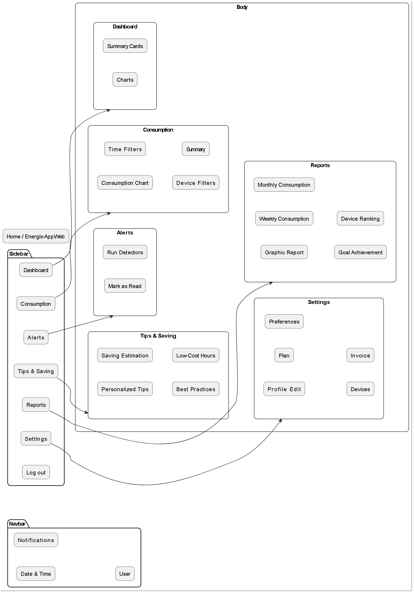
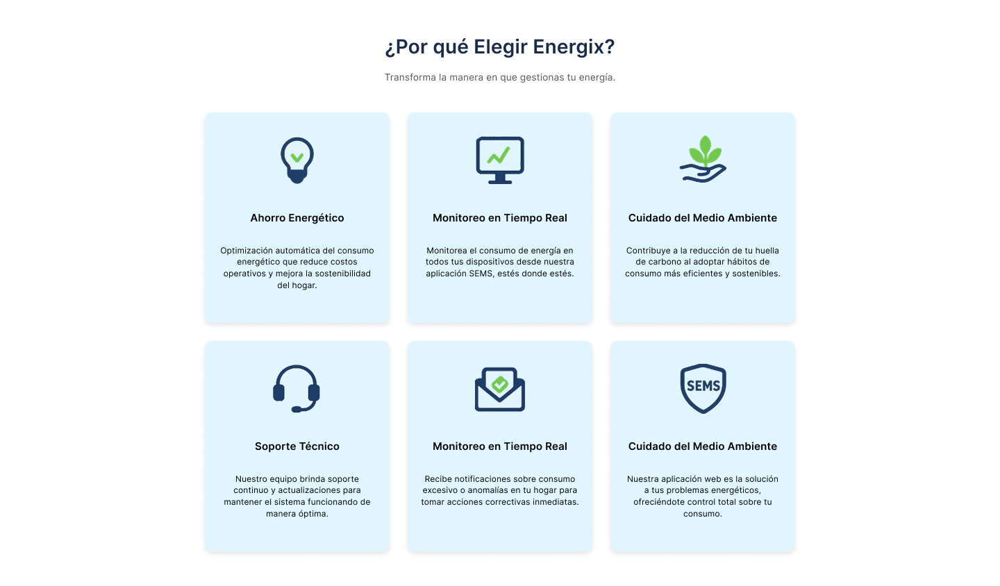

# Capítulo IV: Product Design

## 4.1. Style Guidelines

En esta seccion se establecen las bases con las que realizaremos y organizaremos la presentacion de nuestro proyecto. Se incluyen los General Style Guidelines y los Web Style Guidelines.

### 4.1.1. General Style Guidelines
- En esta sección se detallarán las desiciones fundamentales y las referencias visuales utilizadas para definir aspectos principales del proyecto como los siguiente: Branding, tipografía, colores, spacing y tonos de comunicación.
- - Branding
- - - El nombre completo de nuestro servicio es "Smart Energix Manager".
- - - Para el dominio web y la aplicación, así como para ser más memorables se utilizará el nombre corto "Energix".
- - - El logo representa de forma directa y moderna la combinación de un hogar familiar de color azul con la silueta de un foco ahorrador junto a una hoja, superpuesto en el centro del marcador. Esta combinación visual comunica de manera clara la idea de optimizar el consumo energético en los hogares y reducir el impacto ambiental.    

- - Tipografía
- - - La tipografía principal seleccionada es Lato. Esta fuente fue elegida por su clásiscas proporciones, sobretodo en las mayúsculas dando así harmonía y elegancia a las oraciones motrando contemporaneidad sin ser abrumador.
- - - Tamaños:
- - - - Móvil: Títulos 50px, cuerpo y sibtítulos 20px.
- - - - Web: Títulos 50px, cuerpo y subtítulos 50px.
- - Colores 
- - - Utilizaremos la siguiente paleta de colores:
  
- - - - Este azul moderno, representa confianza y presición para la navegación, Se usará en la parte del encabezado guiando al usuario de forma clara. Evocando la fiabilidad de las herrameintas establecidad.  #0277BD 
- - - - Este tono de azul más claro, llamado "Alice Blue", representa frecusra y tranquilidad. Se usará en la parte inferior de la página web, dandole una la sensación al usuario de paz y pureza. #E1F5FE
- - - - Este gris cálido simple simboliza el punto neutro e imparcial representando comodidad y claridad. Se usará tanto en los botones de acción como en los subtítulos del pié de página. #808080
- - - - Este blanco básico representa la simpliciad e igualdad. Se utilizará en el fondo principal de la página web. #FFFFFF 
- - - - Este negro original manifiesta elegancia a la vez que autorizad y sobresalta entre los demás. Será utilizado en los títulos de la parte de suscripciones y de la app móvil. #000000
- - Spacing
- - - El espacio en el diseño de Energix se enfocará en proporcionar una experiencia visual clara y accesible para el usuario, reflejando así los principios de claridad y orden. Del mismo modo se utilizrán márgenes amplios para resaltar elementos claves, como botones, imágenes y títulos, permitiendo una navegación fluida y amigable.
- - - Los títulos y subtítulos contarán con un espaciado vertical generoso, haciendo fácil la lectura y la jerarquización de la información. Los botones e íconos tendrán márgenes precisos para asegurar la consistencia.
- - Tonos de comunicación 
- - - El tono de comunicación de Energix será amigable, cercano y orientado al usuario. Buscamos establecer una genuina conexión, utilizando un lenguaje claro y conciso, utilizando un lenaguaje claro y accesible, evitando así técnicismos innecesarios. Nuestra comunicación será positiva y alentadora, enfocándose en resaltar los beneficios que ofrecemos. Por último se priorizará la empatía y la comprensión de las necesidades del Usuario, ofreciendo ayuda y soporte de manera oportuna y efectiva. Queremos que el usuario se sienta valorado y escuchado en cada interacción

### 4.1.2. Web Style Guidelines

Esta sección detalla los lineamientos visuales para los componentes de la landing page de Energix, con el objetivo de garantizar una identidad visual coherente, moderna y centrada en la eficiencia energética y la tecnología.

**Botones:**
- **Botones Principales:**
  - **Color de fondo:** Azul oscuro corporativo (#0D47A1).
  - **Color de texto:** Blanco puro (#FFFFFF) para un contraste óptimo.
  -  **Tipografía:** Sans-serif, peso medio, centrado.
  -  **Forma:** Rectangular con esquinas ligeramente redondeadas.

**Tono comunicacional:** 
- Directo, profesional y decisivo. Invita al usuario a realizar acciones clave como "Suscribirse".

**Botones Secundarios:**
  - **Color de fondo:** Blanco (#FFFFFF) o rojo para acciones específicas (#DC3545).
  - **Color de texto:** Negro (#000000) o blanco, según el fondo.
  - **Forma:** Esquinas redondeadas, estilo cápsula o rectangular.
  - **Tono comunicacional:** Ofrece acciones alternativas de forma clara y visible, sin competir con el CTA principal.

**Header**
  - **Texto:** Texto blanco (#FFFFFF) sobre un fondo azul (#02A9F4). Los botones de "EN" e "Inicia Sesión" utilizan texto azul sobre fondo blanco (#FFFFFF) para crear un llamado a la acción claro.
  - **Tipografía:** Sans-serif, con un tamaño de 16px para los enlaces del menú de navegación.
  - **Estilo:** Enlaces sin subrayado, con una alineación limpia y espaciado generoso entre elementos para una fácil navegación.
  - **Tono:** Moderno, profesional y claro, transmitiendo confianza y facilidad de uso.

**Footer:**
- **Fondo:** Se utiliza un fondo blanco (#FFFFFF) para delimitar claramente el final de la página.
- **Texto:**
  - Sobre fondo blanco: Texto en negro (#000000) y gris (#555555).
- **Estructura:** Organizado en columnas para agrupar enlaces de interés, información de contacto y redes sociales.
- **Íconos:** Estilo lineal y simple, en color negro o blanco.
- **Tono:** Informativo, ordenado y profesional. Proporciona un cierre limpio y funcional a la experiencia de navegación.

**Secciones**
  - **Fondo:** Predominan los fondos blancos (#FFFFFF) y azules claros (#E1F5FE) para las tarjetas y el contenido principal, creando un diseño limpio y espacioso. Se utilizan azules más oscuros (#0D47A1, #02A9F4) para cabeceras, pies de página y secciones destacadas, generando contraste.
  - **Bordes:** Bordes consistentemente redondeados en tarjetas, botones y elementos de la interfaz para una apariencia suave y moderna.
  - **Tono:** Profesional, tecnológico y limpio, con un uso generoso del espacio en blanco para facilitar la lectura.

**Iconografía**
  - **Estilo:** Lineal y minimalista. Los iconos son simples, claros y fácilmente reconocibles (p. ej., redes sociales, signos de suma, marcas de verificación).
  - **Colores:** Principalmente monocromáticos en negro (#000000) o blanco (#FFFFFF) para una máxima legibilidad. En secciones específicas, se utiliza el azul principal (#1A73E8) para dar énfasis.
  - **Tono:** Funcional y coherente, asegurando que los iconos apoyen el contenido sin distraer.

**Paleta de Colores Principal**
- **Azules:**
  - **#0D47A1 (Azul oscuro):** Usado en CTAs y elementos de énfasis. Transmite confianza y seriedad.
  - **#02A9F4 (Azul cian):** Utilizado en fondos de tarjetas y secciones destacadas. Aporta un toque tecnológico y fresco.
  - **#E1F5FE (Azul claro):** Para fondos sutiles y estados hover.
- **Neutros:**
  - **#FFFFFF (Blanco):** Color principal para fondos y texto sobre fondos oscuros. Aporta limpieza y espacio.
  - **#000000 (Negro):** Para textos principales, fondos de footer y elementos de alto contraste.
  - **#555555 (Gris oscuro):** Para textos secundarios y detalles.
- **Acentos:**
  - **#DC3545 (Rojo):** Reservado para acciones de cancelación o advertencia.

**Tono Comunicacional General**
 - **Profesional y Tecnológico:** El lenguaje y el diseño reflejan una marca experta en soluciones de energía.
 - **Claro y Directo:** La comunicación es concisa, facilitando al usuario la comprensión de los beneficios y el uso del sistema.
 - **Confiable y Eficiente:** Transmite seguridad y resalta el ahorro y la sostenibilidad como valores clave.


## 4.2. Information Architecture

En esta seccion mostramos las decisiones de Arquitectura de Informacion para organizar el contenido de nuestra aplicacion de tal manera que los usuarios puedan tener una experiencia eficiente. Se incluyen las secciones de Organization Systems, Labeling Systems, Navigation Systems y Searching Systems.

### 4.2.1. Organization Systems
Aplicación web:
Dentro de la app, el sistema de organización se basa en un menú lateral que agrupa las funciones principales (Dashboard, Reportes, Consumo, Configuración, Perfil). Esto permite que el usuario mantenga un control claro de su progreso y pueda acceder rápidamente a las herramientas según sus metas.


### 4.2.2. Labeling Systems

Al acceder a la plataforma web de Energix, los usuarios pueden explorar los servicios, productos y planes de suscripción. La página está diseñada para informar sobre los beneficios de la gestión energética inteligente y convertir visitantes en clientes.

#### Navbar (Menú Principal):

- **"Inicio"**: Redirige a la sección principal de bienvenida de la página.
- **"Beneficios"**: Muestra las ventajas clave del sistema, como el ahorro y el monitoreo.
- **"Productos"**: Presenta el hardware disponible, como el "Enchufe Inteligente".
- **"Suscripciones"**: Detalla los diferentes planes de pago (Básico, Premium, Anual).
- **"Nuestro Equipo"**: Presenta a los miembros del equipo detrás de Energix.
- **"FAQ"**: Lleva a la sección de preguntas frecuentes.
- **"EN/ES":** Botón para alternar el idioma de la página entre inglés y español.
- **"Iniciar Sesión"**: Botón para que los usuarios registrados accedan a la plataforma SEMS.

#### Secciones Principales:

- **"¡Energix tiene la solución!"**: Encabezado principal de bienvenida que capta la atención del usuario.
- **"¿Por qué Elegir Energix?"**: Sección que detalla las características principales: "Ahorro Energético", "Monitoreo en Tiempo Real", "Cuidado del Medio Ambiente", "Soporte Técnico", "Alertas Personalizadas" y "Acceso a SEMS".
- **"Productos"**: Presentación de 5 prodcutos que pueden ayudarte en la tarea de ahorrar y de alientan a la acción de "Comprar".
- **"Suscripciones"**: Tabla comparativa de los planes "Básico", "Premium" y "Anual", cada uno con un botón de "Suscribirse".
- **"About The Team"**: Describe la "Misión", "Visión" y "Valores" de la Startup.
- **"Nuestro Equipo"**: Muestra los perfiles de los integrantes del proyecto.
- **"Preguntas Frecuentes"**: Área interactiva para resolver las dudas más comunes de los usuarios.

#### Formulario de Suscripción (Footer):

- **"Tu correo"**: Campo para que el usuario ingrese su dirección de email.
- **"Enviar"**: Botón para suscribirse al boletín o solicitar información.

#### Pie de Página:

- **"Opciones sobre el ahorro de energía"**: Enlaces a artículos o guías sobre eficiencia energética.
- **"Beneficios de ahorrar energía"**: Acceso rápido a información sobre las ventajas económicas y ecológicas.
- **"Más información"**: Enlaces a recursos externos y temas de interés relacionados.
- **"Contáctanos"**: Sección con el formulario de suscripción por correo.
- **"Redes Sociales"**: Iconos que enlazan a los perfiles sociales de la empresa.

### 4.2.3. SEO Tags and Meta Tags
- Los SEO Tag y Meta Tags ayudarán a que la página estática y la aplicación web sea posible de analizar fácilmente y se pueda gestionar de manera eficiente y optima.


- **Título** El título de nuestra Staruo se definirá de la siguiente manera:
- ```html 
  <title>ENERGIX</title>

- **Descripción** Las descripciones de nuestra Starup se definirá de la siguiente manera:
- ```html 
  <meta name="description" content="Energix es una aplicación que ayudará a los usuarios a poder optimizar sus consumos de energía"/>

- **Keywords**: Algunas Keywords como "viewport" se definirá de la siguiente manera:
- ```html 
  <meta name="viewport" content="width=device-width, initial-scale=1.0">

-**Author**: Nuestra marca será registrada en nuestra página de la siguiente manera:
- ```html 
  <meta name="copiright" content="© 2024 ENERGIX. Todos los derechos reservados"/>
### 4.2.4. Searching Systems
El sistema de búsqueda en Energix se centra en evitar la sobrecarga de información y en ayudar al usuario a localizar rápidamente los datos que necesita.

Opciones de búsqueda ofrecidas

Barra de búsqueda global: disponible en la Navbar para encontrar dispositivos, reportes o alertas de forma directa.

Filtros específicos por módulo:

Consumo: filtros por tiempo (diario, semanal, mensual) y por dispositivo.

Reportes: filtros por tipo de reporte (semanal, mensual, cumplimiento de metas, ranking de dispositivos).

Alertas: filtros por estado (leídas/no leídas, activas/inactivas).

Consejos & Ahorro: filtros por categoría (buenas prácticas, estimación de ahorro, horarios de menor costo).

Visualización de los resultados de búsqueda

Los resultados se mostrarán en listas o gráficos, dependiendo del contexto:

En Consumo: los gráficos se actualizan dinámicamente según los filtros aplicados.

En Reportes: los reportes filtrados aparecen en lista y pueden abrirse individualmente.

En Alertas: las alertas se muestran en un listado reducido según los criterios de búsqueda.

Resaltado de coincidencias: las palabras clave buscadas se destacan para facilitar la identificación de información relevante.
### 4.2.5. Navigation Systems
El sistema de navegación en Energix está diseñado para guiar al usuario de forma intuitiva tanto en la Landing Page como en la Aplicación Web, asegurando que logre sus objetivos de manera eficiente.

#### Navegación en la Landing Page

Una barra de navegación superior con secciones principales: Inicio, Características, Planes, Contacto.

Botones de llamada a la acción (CTA) ubicados estratégicamente para llevar al usuario hacia el registro, inicio de sesión o exploración de funciones.

Estructura de desplazamiento (scrolling) con enlaces ancla para moverse entre secciones (ejemplo: beneficios, precios, testimonios).

#### Navegación en la Aplicación Web

Un sidebar fijo con los módulos clave: Dashboard, Consumo, Alertas, Consejos & Ahorro, Reportes, Configuración, Cerrar sesión.

Enlaces contextuales dentro de cada módulo para profundizar en funciones (ejemplo: en Consumo → filtros por dispositivo o por tiempo).

Una barra superior (Navbar) con accesos rápidos a Notificaciones, Fecha y Hora, Perfil de Usuario.

Estructura jerárquica clara: Sidebar (categorías principales) → Body (contenido detallado).

## 4.3. Landing Page UI Design
### 4.3.1. Landing Page Wireframe


### 4.3.2. Landing Page Mock-up





## 4.4. Web Applications UX/UI Design
### 4.4.1. Web Applications Wireframes
### 4.4.2. Web Applications Wireflow Diagrams
### 4.4.2. Web Applications Mock-ups
### 4.4.3. Web Applications User Flow Diagrams
- User goal 1: Iniciar sesión para poder obversar el dashboard informativo

- User goal 2: Entrar al dashboard informativo para luego entrar en la opción de Reportes y descargar mi reporte generado a lo largo del mes

- User goal 3: Comprar un producto desde la página principal rellenando información del medio de pago elegido.

- User goal 4: Entrar al dashboard interactivo para luego ir a la opción de consumo y poder visualizar mi historial de consumo energético a lo largo de los últimos 3 meses

#
- Happy y Unhappy paths de cada User goal:
- **User goal 1**:
- - (Happy path) El usuario entra a la landing page y encuentra el botón de Iniciar sesión, como ya tiene una cuenta ingresa sus credenciales y son validadas por el sistema, una vez todo correcto es redirigido al dashboard informativo donde podrá interactuar con las diferentes herrameintas disponibles.
- - (Unhappy path) El usuario entra a la landing page y presiona el botón de Inicar sesión, ingresa sus credenciales pero son incorrectas por lo que el sistema le manda un mensaje de error que dice "Correo o contraseña incorrectos", por lo que no será redirigido al dashboard informativo.
- **User goal 2**:
- - (Happy path) El usuario accede al landing page y hace click en Iniciar Sesión, ingresa con sus credenciales y tras una validación es redirigido al dashboard informativo. Navega por el menú lateral y hace click en la opción de Reportes donde visualiza el panel con la información de su consumo de mes, cumplimiento de metas, ranking de dispositivos y ahorro acumulado, entonces el usuario presiona el botón para descarga la información en formato PDF y Excel, luego aparece un mensaje diciendo "Reporte descargado exito" con la opción de visualizar el reporte.
- - (Unhappy path) El usuario accede al landing page y hace click en Iniciar Sesión, ingresa con sus credenciales y tras una validación es redirigido al dashboard informativo. Navega por el menú lateral y hace click en la opción de Reportes, al momento de entrar no le aparecerá ninguna información disponible por lo que el sistema le dará un mensaje diciendo "Error al momento de cargar la información", del mismo modo si presiona el botón de descargar el sistema le dirá "Error al momento de descargar intente más tarde", por lo que el usuario no podrá visualizar su información ni descargarla.
- **User goal 3**:
- - (Happy path) El usuario ingresa a la landing page y se desplaza hacia la parte de productos, selecciona uno de los productos que están disponibles, luego se le habilitará una ventana para que eliga el método de pago preferido, una vez que rellene la información necesaria el sistema validará los datos y le dará un mensaje diciendo "Pago realizado, gracias" junto al logo con el método seleccionado.
- - (Unhappy path) El usuario ingresa a la landing page y se desplaza hacia la parte de productos, selecciona uno de los productos que están disponibles, luego se le habilitará una ventana para que eliga el método de pago preferido, una vez que el usuario rellene toda la información necesaría le dará click al botón de "pagar", pero no pasará nada, no le aparecerá otra ventana diciendo "Pago realizado, gracias", debido a un error interno con los métodos de pago por lo que no se puede continuar con la transacción, por consiguiente el usuario no podrá comprar ningún producto.
- **User goal 4**:
- - (Happy path) El usuario navega por la landing page, entra al dashboard informativo mediante el botón Iniciar Sesión, luego de la validación entra al dashboard y hace click en la opción de Consumo, donde puede visualizar más detalladamente los kilowhats consumidos, el porcentaje total, los tiempos de uso de cada dispositivo y el costo estimado para el mes.
- - (Unhappy path) El usuario navega por la landing page, entra al dashboard informativo mediante el botón Iniciar Sesión, luego de la validación entra al dashboard y hace click en la opción de Consumo, al momemto de entar el usuario no podrá visualizar los datos completos, estarán imcompletos o desactualizados en los indicadores principales, por lo que no podrá visualizar la información detallada.
## 4.5. Web Applications Prototyping

## 4.6. Domain-Driven Software Architecture
### 4.6.1. Design-Level Event Storming
### 4.6.2. Software Architecture Context Diagram

El diagrama de contexto de SEMS (Smart Energy Management System) muestra la visión más externa de la plataforma y posiciona a sus actores principales junto con los sistemas con los que se conecta. En este nivel se identifican tres roles clave: el propietario de vivienda, que busca monitorear y optimizar el consumo energético de su hogar; el estudiante que alquila, interesado en reducir gastos y simplificar el control compartido de la energía; y el soporte técnico, encargado de acompañar a los usuarios en la resolución de problemas y la adopción de la herramienta.

SEMS se apoya además en tres sistemas externos que amplían sus capacidades sin comprometer el núcleo de la solución: el medidor inteligente, que provee datos de consumo en tiempo real; los dispositivos del hogar, que pueden ser encendidos o apagados de forma remota para optimizar el uso energético; y el proveedor de servicios eléctricos, que ofrece información sobre tarifas, consumo histórico y posibles incidencias en el suministro.

Esta integración permite que SEMS funcione como un ecosistema completo para el control y la gestión energética doméstica. Al reunir usuarios, dispositivos y datos bajo una infraestructura digital modular, la plataforma fortalece su propuesta de valor: ofrecer a las personas un sistema confiable, accesible y proactivo que contribuya tanto al ahorro económico como a la sostenibilidad ambiental.


### 4.6.3. Software Architecture Container Diagrams
- Este diagrama de contenedores ilustra los componentes clave de la plataforma ENERGIX y cómo interactúan entre sí y con sistemas externos. Se destacan la **Aplicación web**, **la API Backend**, **la Base de Datos** y **servicios externos** como xxx xxx y xxx xxx. Cada contenedor cumple una función específica para asegurar el funcionamiento integral del sistema.

### 4.6.4. Software Architecture Components Diagrams
El diagrama de componentes profundiza en la arquitectura interna de la plataforma Energix, enfocándose en la estructura del contenedor REST API. Este diagrama ilustra cómo las responsabilidades de la lógica de negocios se dividen en capas distintas: Controladores, Servicios y Repositorios, lo que garantiza una clara separación de preocupaciones y un código más mantenible.

**Capas del Diagrama**

- **Controladores**: Los controladores (AuthController, DeviceController, AutomationController, ReportController, AlertController) actúan como el punto de entrada principal desde el Frontend Web SPA. Procesan las solicitudes de los usuarios y las dirigen a los servicios correspondientes para su procesamiento.
- **Servicios**: Los servicios (AuthService, DeviceService, AutomationService, ReportService, AlertService) encapsulan la lógica de negocio de la plataforma. Cada servicio maneja un contexto funcional específico: AuthService gestiona la autenticación, DeviceService se encarga de los dispositivos, AutomationService administra las reglas de automatización, ReportService genera informes y AlertService maneja las notificaciones.
- **Repositorios**: Los repositorios (UserRepository, DeviceRepository, AutomationRepository, ReportRepository, AlertRepository) son la capa de acceso a datos. Gestionan la persistencia y la recuperación de información desde la base de datos externa (Database) para sus respectivos servicios.

**Integración de Componentes Externos**

La plataforma se comunica con otros sistemas y contenedores para ofrecer su funcionalidad completa.  La capa de servicios interactúa con contenedores externos clave: DeviceService y AlertService utilizan el Message Broker para la comunicación asíncrona y la gestión de eventos en tiempo real.

- ReportService y AlertService se conectan con el File Storage para almacenar informes generados y archivos adjuntos de notificaciones, respectivamente.
- Por último, todos los repositorios se comunican con la Database para almacenar y recuperar la información esencial del sistema, como datos de usuarios, dispositivos, automatizaciones, reportes y alertas.

Esta estructura modular y desacoplada facilita el desarrollo, las pruebas y el mantenimiento del sistema, permitiendo que cada componente se evolucione de forma independiente sin afectar a los demás.


## 4.7. Software Object-Oriented Design
### 4.7.1. Class Diagrams

**Identity and Access Management**


Este diagrama muestra la arquitectura en capas (Aplicación, Dominio, Infraestructura) para el Bounded Context de Identidad y Gestión de Acceso. La capa de Aplicación (AuthController y AuthService) se encarga de recibir las peticiones de autenticación y registro. El núcleo es la capa de Dominio, que se centra en las entidades User y Role, que definen las reglas de negocio, y las interfaces UserRepository y TokenService, que establecen los contratos para la persistencia y la gestión de tokens. La capa de Infraestructura (UserRepositoryImpl y Database) implementa estas interfaces, gestionando la conexión y las operaciones de persistencia con la base de datos. La dependencia del sistema siempre apunta hacia la capa de Dominio, lo que asegura que la lógica central no dependa de los detalles de la implementación.

**Connected Device Management**


Este diagrama detalla la arquitectura en capas (Aplicación, Dominio, Infraestructura) para el Bounded Context de Gestión de Dispositivos Conectados. La capa de Aplicación (DeviceController y DeviceService) gestiona las peticiones para el registro, monitoreo y configuración de los dispositivos. El corazón del sistema es la capa de Dominio, que se centra en el agregado Device, y las entidades relacionadas como DeviceConfig, DeviceStatus y DeviceType, que encapsulan la lógica de negocio de los dispositivos inteligentes. El Dominio también define la interfaz DeviceRepository. La capa de Infraestructura (DeviceRepositoryImpl y SmartDeviceService) implementa la persistencia a través de la base de datos y se comunica con los dispositivos reales, garantizando que la lógica de negocio esté desacoplada de los detalles técnicos de la comunicación.

**Report Management**


Este diagrama ilustra la arquitectura en capas (Aplicación, Dominio, Infraestructura) del Bounded Context de Gestión de Reportes. La capa de Aplicación (ReportController y ReportService) se encarga de coordinar la generación y consulta de reportes, recibiendo las peticiones de los usuarios. El centro de la arquitectura es la capa de Dominio, centrada en el agregado Report y sus componentes internos como ReportData y ReportType, que definen la estructura y las reglas de negocio de los reportes. El Dominio también establece la interfaz ReportRepository. La capa de Infraestructura (ReportRepositoryImpl y FileStorage) implementa la lógica de persistencia, con ReportRepositoryImpl gestionando la base de datos y FileStorage almacenando los archivos de reportes en un sistema externo, manteniendo así la lógica de negocio independiente de la forma de almacenamiento.

**Alert and Notification Management**


Este diagrama presenta la arquitectura en capas (Aplicación, Dominio, Infraestructura) del Bounded Context de Gestión de Alertas y Notificaciones. La capa de Aplicación (AlertController y AlertService) gestiona la creación, actualización y eliminación de alertas. El núcleo es la capa de Dominio, centrada en la entidad Alert y sus subtipos AlertType y AlertSeverity, que encapsulan las reglas de negocio para los distintos tipos de alertas y su severidad. Las interfaces AlertRepository y NotificationService definen los contratos para la persistencia y el envío de notificaciones. La capa de Infraestructura (AlertRepositoryImpl y MessageBroker) implementa estos contratos, con AlertRepositoryImpl gestionando la base de datos y MessageBroker interactuando con un sistema externo para el envío de mensajes, asegurando que la lógica de negocio principal sea agnóstica a la tecnología de mensajería.

**Automation Management**


Este diagrama muestra la arquitectura en capas (Aplicación, Dominio, Infraestructura) del Bounded Context de Gestión de Automatizaciones. La capa de Aplicación (AutomationController y AutomationService) coordina la lógica para la creación y gestión de las reglas de automatización. El corazón del sistema es la capa de Dominio, que se centra en el agregado Automation y sus objetos internos AutomationTrigger, AutomationAction y Schedule, que definen las reglas de negocio y el comportamiento de las automatizaciones. El Dominio también especifica la interfaz AutomationRepository. La capa de Infraestructura (AutomationRepositoryImpl y TaskScheduler) implementa la persistencia y la ejecución de las tareas programadas, desacoplando la lógica de negocio del mecanismo específico de programación, lo que permite una mayor flexibilidad y escalabilidad.

## 4.8. Database Design
### 4.8.1. Database Diagrams


