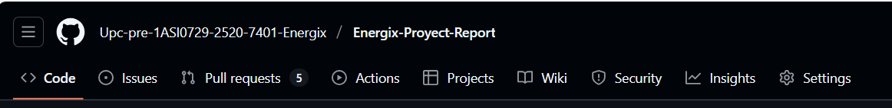
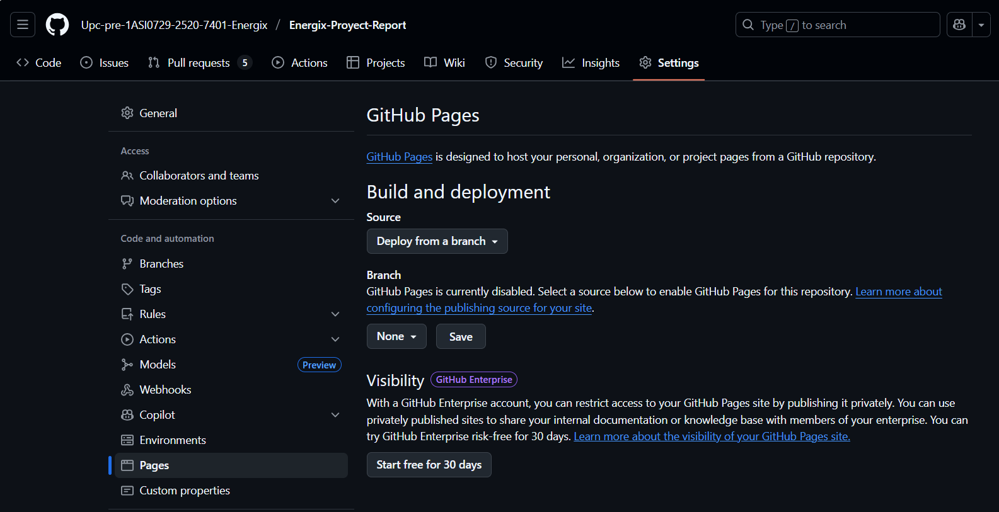
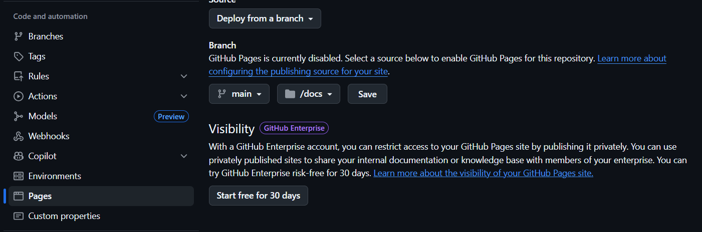
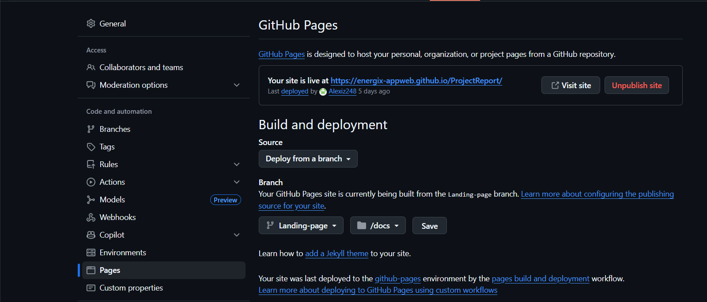
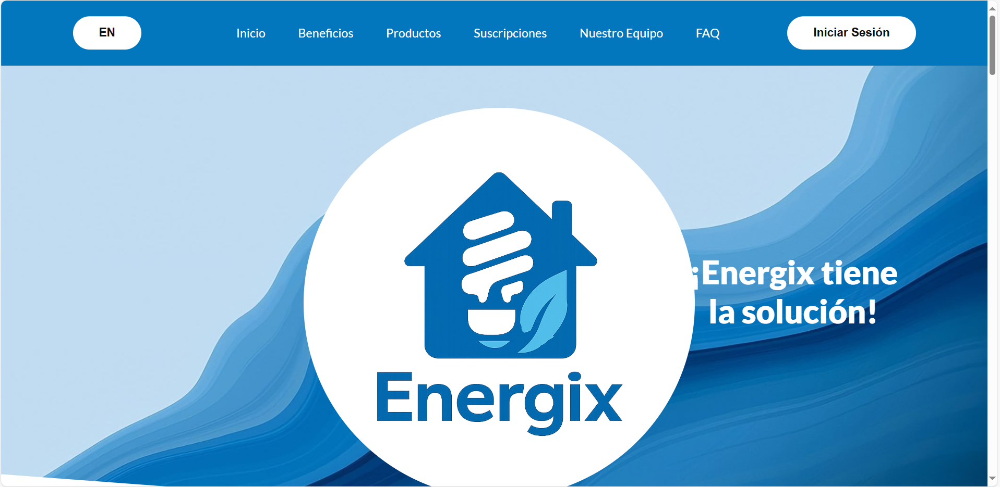

# Capítulo V: Product Implementation, Validation & Deployment

## 5.1. Software Configuration Management
### 5.1.1. Software Development Environment Configuration
### 5.1.2. Source Code Management

La gestión del código fuente es parte fundamental del desarrollo de cualquier proyecto de software, ya que nos permitirá rastrear cambios, revertir versionas y coordinar a los diferentes integrantes del equipo a la misma vez. En ENERGIX, utilizaremos **GitHub** como plataforma para alojar nuestros repositorios.

**URL de los Repositorios**

- **Organization:** https://github.com/Upc-pre-1ASI0729-2520-7401-Energix 
- **Reporte:** https://github.com/Upc-pre-1ASI0729-2520-7401-Energix/Energix-Proyect-Report 
- **Landing Page:** https://github.com/Upc-pre-1ASI0729-2520-7401-Energix/Energix-Landing-Page

**Commits Convencionales**

Para los mensajes de commit en el proyecto ENERGIX, se sigue la convención **Coventional Commits**. Estos mensajes deben seguir el formato estándar para facilitar la lectura y entendimiento del historial del proyecto:

``` githubexpressionlanguage
<type>[optional scope]:<decription>

[optional body]

[optional footer(s)]
```

- **Type**
-  -  ```feat```: Se usa cuando se añade una nueva catacterística.  
-  -  ```fix```: Para la correción de errores.
-  -  ```docs```: Modificaciones en la documentación.
-  -  ```style```: Cambios que no afectan la lógica del código, como los formatos o estilos.
-  -  ```refactor```: Modificaciones que no añaden características ni corrigen errores.
-  -  ```test```: Addicón o modificación de pruebas.

- **Scope:** Proporciona información adicional sobre el área del código afectada.

**Ejemplos de commits**

- ```feat(login): add user authentication module```
- ```fix(payment): resolve payment gateway issue``` 
- ```docs(README): update setup instructions```

Con estas estructuras, ENERGIX se puede gestionar eficientemente el flujo de trabajo del desarrollo, asegurándonos una integración continua y una organización clara del código.

### 5.1.3. Source Code Style Guide & Conventions
En el proyecto ENERGIX, hemos implementaado una serie de guías de estilo y convenciones para asegurar que todo el equipo de desarrollo siga una estructura consistente y clara en todo el desarrollo del proyecto. Facilitando la legibidad del código, mejorando la colaboración entre los integrantes asegurando que el código sea mantenible a largo plazo.

**Nomenclatura General**

Para asegurar la coherencia en todo el código, seguiremos las siguientes directrices:

- Los nombres de variables, funciones y métodos deben utilizar **camelCase**.
- Los nombres de clases y componentes seguirán la convención **PascalCase**.
- Para los archivos y carpetas, se empleará la convención **kebab-Case**.

El uso de **ingles** para todos los nombres es obligatorio, con el fin de asegurar la comprensión entre los miembros del equipo y seguir las buenas prácticas.

**Ejemplo**

- **Variables:** ``` home```,```userLocation```
- **Clases:** ``` HomeOwner```,```user```
- **Archivos:** ```home-owner.service.js```,```user.controller.js```

**Espacios y Sangrías**

La sangría de código en ENERGIX seguirá las siguientes reglas para asegurar la claridad y el orden del código:

- Se utilizarán **2 espacios** para la sangría en archivos HTML, CSS, JavaScript, y TypeScript.
- En archivos **Java**, se utilizarán **4 espacios** para la sangría.

Esta convención ayuda a mantener la consistencia en todos los lenguajes empleados en el proyecto, facilitando la colaboración entre los diferentes miembros del equipo.

``` html
<!DOCTYPE html>
<html>
  <head>
    <title>Energix</title>
  </head>
  <body>
    <h1>Registros Disponible</h1>
    <p>Registra tus dispositivos fácilmente</p>
  </body>
</html>
```

**Convenciones por Lenguaje**

1. HTML/CSS/JavaScript:

- - Se utilizará la Google HTML/CSS Style Guide (https://google.github.io/styleguide/htmlcssguide.html) para asegurar la consistencia en la estructura y la presentación de los archivos HTML y CSS.
- - Para JavaScript, adoptamos la Airbnb JavaScript Style Guide (https://google.github.io/styleguide/htmlcssguide.html), ampliamente conocida y utilizada en la industria.

2. TypeScript:

- - Angular es el framework elegido para el frontend de PARKINGNOW, por lo que seguimos la Angular Style Guide (https://v17.angular.io/guide/styleguide), que dicta cómo deben estructurarse los módulos, servicios y componentes.
- - También seguimos la Google TypeScript Style Guide (https://google.github.io/styleguide/tsguide.html) para garantizar la correcta tipificación y legibilidad del código.

3. Java:

- - En el backend, utilizamos Spring Boot para crear APIs y servicios web. Seguimos la Google Java Style Guide (https://google.github.io/styleguide/javaguide.html) para mantener consistencia en la estructura de las clases y los métodos.
- - Los nombres de clases serán descriptivos, utilizando sustantivos para clases y verbos para métodos.

**Ejemplo de una clase Java** 

``` javascript 
public class HomeOwner {
  private int totalDevices;

  public HomeOwner(int spaces) {
    this.availableSpaces = spaces;
  }

  public void devicesRegistered() {
    if (availableSpaces > 0) {
      availableSpaces--;
    }
  }
}
```

4. **Gherkin**
- - Para escribir los tests automatizados, seguimos la convención de Gherkin Syntax. (https://cucumber.io/docs/gherkin/) Esto permite una descripción clara y precisa de los escenarios de prueba en los archivos .feature.
- - Utilizamos Given-When-Then para describir el comportamiento esperado en cada escenario.

**Ejemplo de Gherkin**

``` gherkin
Feature: Registro de dispositivo 

  Scenario: Registro exitosa
    Given el usuario ha iniciado sesión
    When selecciona la opción de dispositivos
    Then el usuario debe configurar el dispositivo a registrar
    Then el sistema debe confirmar el registro
    
```

**Espacios y Comillas**

- **Espacios:** Siempre se debe colocar un espacio alrededor de los operadores y entre los parámetros en las funciones.

**Ejemplo:**

``` typescript

let totalDevices = 50;
let devicesRegistered = 10;
let availableSpace = totalDevices - devicesRegistered;
 
```
- **Commillas:** En **JavaScript** y **TypeScript**, se utilizan comillas simples ```(')``` para cadenas, mientras que en **HTML** se prefieren las comillas dobles ```(")```.

**Limite de Longitud de Línea**

El código no debe exceder las 80 columnas por líneas. En caso de necesitar más espacios, se recomienda dividir la línea de código para mejorar la legibilidad. 
### 5.1.4. Software Deployment Configuration
- En esta sección se detalla la configuración necesaria para el despliegue de la solución ENERGIX, incluyendo los pasos claves para lograr la publicación satisfactoria de la **Landing Page**, **Servicios Web** y **Aplicaciones Web Frontend** utilizando GitHub Pages para visualizar cada commit del **Landing Page**.

- A continuación, se describen los pasos para realizar el despliegue de la **Landing Page** del proyecto ENERGIX.
- 1- **Actualización de Ramas**: Asegúrate de que todas las ramas del repositorio estén actualizadas. Luego, ingresa a Github y dirígete al repositorio del proyecto ENERGIX.
- 2- **Acceso a las configuraciones**: Una vez dentro del repositorio, haz click en la pestaña **Settings** en la parte superior del repositorio.

- 3- **Selección de GitHub Pages**: Dentro de la sección **Settings**, en el menú lateral, busca la opción llamada **Pages**. Esta opción permite configurar el despliegue de la página desde una rama específica del repositorio.

- 4- **Configuración de la Rama Principal**: En la opción **Pages**, selecciona la rama principal (generalmente llamada **main** o **master**). Luego, haz click en el botón **Save** para iniciar el proceso de deploy de la página.

- 5- **Confirmación del Deploy** Una vez que GitHub complete el proceso de deploy, en la parte superior de la sección **Pages** se mostrará un mensaje de confirmación junto con el enlace generado para acceder a la **Landing Page** del proyecto.

- 6- **Acceso a la página**: Finalmente, podrás acceder a la **Landing Page** desde el enlace que se generó al finalizar el deploy. Aquí está el enlace para el proyecto ENERGIX:

## 5.2. Landing Page, Services & Applications Implementation
### 5.2.X. Sprint n
#### 5.2.X.1. Sprint Planning n
#### 5.2.X.2. Aspect Leaders and Collaborators
#### 5.2.X.3. Sprint Backlog n
#### 5.2.X.4. Development Evidence for Sprint Review
#### 5.2.X.5. Execution Evidence for Sprint Review
#### 5.2.X.6. Services Documentation Evidence for Sprint Review
#### 5.2.X.7. Software Deployment Evidence for Sprint Review
#### 5.2.X.8. Team Collaboration Insights during Sprint

## 5.3. Validation Interviews
### 5.3.1. Diseño de Entrevistas
### 5.3.2. Registro de Entrevistas
### 5.3.3. Evaluaciones según heurísticas

## 5.4. Video About-the-Product

# Conclusiones
- Conclusiones y recomendaciones

# Video About-the-Team

# Bibliografía

# Anexos
